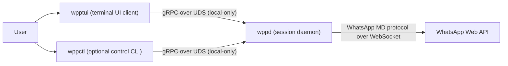
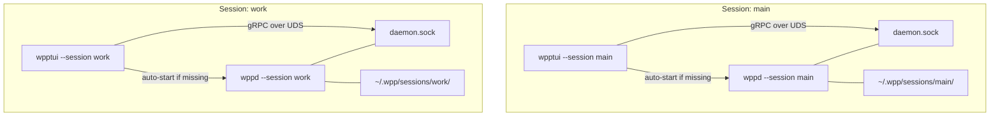
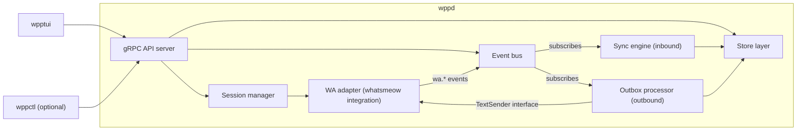
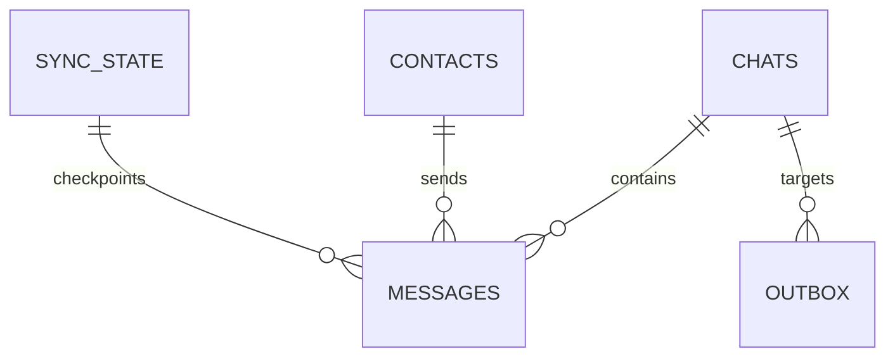
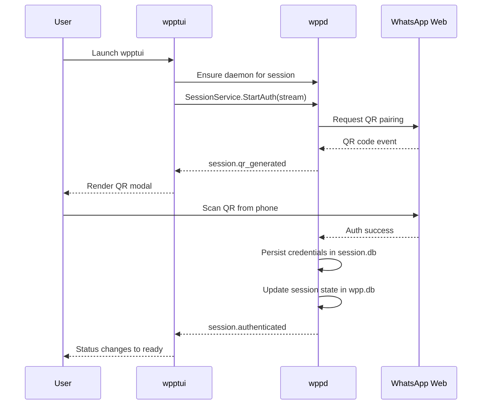
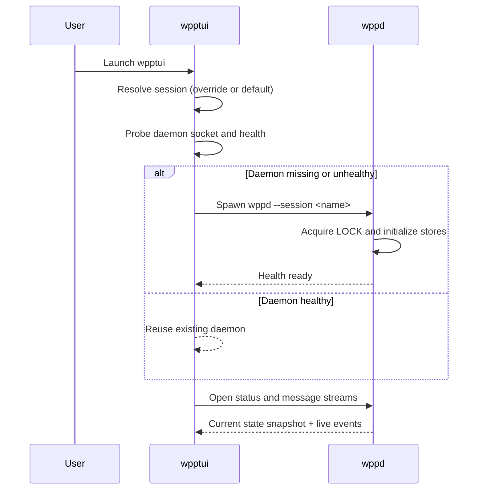
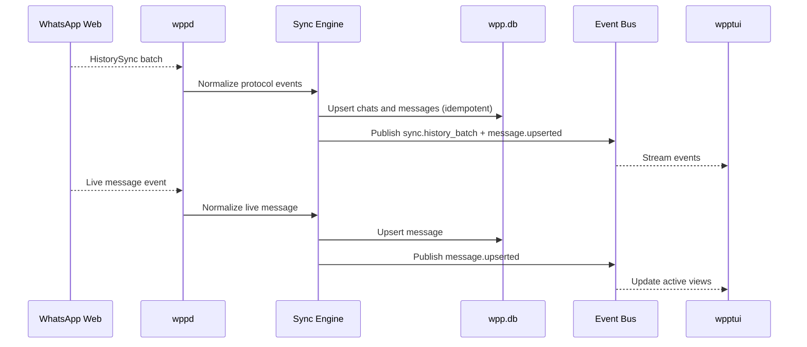
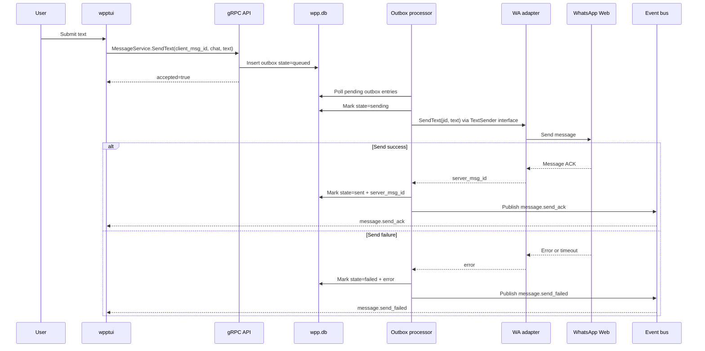
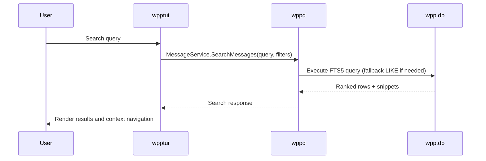

# WPP-TUI Architecture Blueprint (v1)

## 1. Purpose and Audience
This document defines the normative v1 architecture for WPP-TUI. It is written for contributors implementing and reviewing the first production-ready version of the system.

Product intent, scope boundaries, and user-value priorities are defined in `.context/SPEC.md`. This architecture document translates those product constraints into implementation-ready system decisions.

## 2. System Context
WPP-TUI is a local-first, terminal-native system with a strict process boundary between UI and backend runtime.

System boundary rules:
- `wpptui` does not read or write SQLite directly.
- `wppd` is the only process that talks to WhatsApp Web.
- `wppctl` is optional and uses the same local API contract as `wpptui`.
- No remote API exposure in v1.

## 3. Architectural Principles
This architecture directly maps to SPEC pillars.

| SPEC Pillar | Architectural Implication |
|---|---|
| Speed | Keep data local in SQLite; use streaming API updates instead of polling; avoid cross-process overhead beyond local UDS. |
| Clarity | Define explicit boundaries: UI client, daemon runtime, persistence ownership, and service contracts. |
| Flow | Auto-start daemon from TUI when missing; keep sync and auth state continuously observable through stream events. |
| Confidence | Idempotent ingestion, process isolation per session, explicit failure states, and deterministic recovery behavior. |

Tradeoff policy:
- Prefer reliability and focus over feature breadth.
- Prefer explicit boundaries over short-term shortcuts.
- Defer parity features that threaten responsiveness or operational simplicity.

## 4. Runtime Topology
v1 uses one daemon per session. A session is the canonical identity profile term.

Topology constraints:
- Daemon binds a Unix domain socket inside its session directory.
- One lock file protects each session daemon/runtime.
- Sessions are isolated at process, socket, and storage levels.

## 5. Session Model
### 5.1 Session Selection Contract
Active session resolution is deterministic:
1. Use CLI override `--session <name>` if provided.
2. Otherwise use `default_session` from config.
3. If config is absent on first run, initialize config with `default_session = "main"`.

This is the canonical contract for all first-party binaries.

### 5.2 Naming and Validation
Session name constraints:
- Lowercase letters, numbers, hyphen, underscore.
- Maximum 64 characters.
- Must be stable filesystem-safe identifier.

### 5.3 Filesystem Layout and Ownership
Global config:
- `~/.wpp/config.toml` with `default_session`.

Per-session directory:
- `~/.wpp/sessions/<session>/session.db`
- `~/.wpp/sessions/<session>/wpp.db`
- `~/.wpp/sessions/<session>/daemon.sock`
- `~/.wpp/sessions/<session>/LOCK`
- `~/.wpp/sessions/<session>/logs/wppd.log`

Ownership rules:
- `wppd` creates and owns runtime artifacts for its session.
- `wpptui` may bootstrap daemon process but does not mutate DB files directly.
- `wppctl` never mutates files directly.

Permission baseline:
- Session directory: `0700`
- Database files: `0600`
- Socket file: `0600`
- Log files: `0600`

## 6. Component Architecture

Component responsibilities:
- `gRPC API server`: handles request/response APIs and stream subscriptions.
- `Session manager`: resolves lifecycle state, startup mode, and lock coordination.
- `WA adapter`: wraps WhatsApp protocol client, normalizes raw protocol events, publishes to event bus. Does not import sync or outbox directly.
- `Sync engine`: subscribes to `wa.*` bus events and applies idempotent ingestion into `wpp.db`.
- `Outbox processor`: polls the outbox table and sends queued messages via the `TextSender` interface (satisfied by WA adapter). Publishes `message.send_ack` / `message.send_failed` events.
- `Store layer`: persistence, query execution, migration ownership for `wpp.db`.
- `Event bus`: decoupling point between WA adapter, sync engine, outbox, and API stream subscriptions. No direct imports between `wa`, `sync`, and `outbox`.

`wpptui` internal architecture (k9s-inspired, see [TUI.md](./TUI.md)):
- API client: gRPC request/stream client (`internal/tui/client/`).
- View-model state: cache of chats/messages/status from API events (`internal/tui/model/`).
- UI primitives: domain-agnostic components — theme, pages stack, crumbs, flash, prompt, menu, session info (`internal/tui/ui/`).
- Domain views: conversation list, message thread, conversation info, search, auth, help (`internal/tui/views/`).
- App shell: k9s-style layout with Header/Prompt/Content/Crumbs/Flash, stack navigation, command mode (`:`), filter mode (`/`), numeric shortcuts (`internal/tui/app.go`).
- Contact name resolution: store queries JOIN contacts table for display name fallback (chat.name -> contact.push_name -> contact.name -> JID).

`wppctl` role:
- Operational/debug client for status, auth, sync, and diagnostics.

## 7. Public Interfaces and Contracts
All interfaces below are private local contracts in v1 and may change before 1.0.

### 7.1 CLI Contracts
| Binary | Contract | Required Behavior |
|---|---|---|
| `wpptui` | `wpptui [--session <name>]` | Resolve session; auto-start daemon if unavailable; connect streams; render live state. |
| `wppd` | `wppd --session <name>` | Acquire lock; initialize stores; serve local gRPC over session socket. |
| `wppctl` | `wppctl --session <name> <command>` | Execute operational commands against the same local daemon API. |

### 7.2 gRPC Service Surface
Canonical service families:
- `SessionService`: session status, auth flow stream, logout/session reset actions.
- `SyncService`: start/stop sync intent, sync status, lifecycle stream.
- `ChatService`: list and inspect chats plus read-side metadata.
- `MessageService`: list/search messages, send text, message event stream.

### 7.3 Event Contracts
Event families:
- Session/auth events: QR generated, auth succeeded, auth failed, logged out.
- Sync lifecycle events: connecting, connected, history batch processed, reconnecting, disconnected, degraded.
- Message events: upserted, send accepted, send failed.

Event envelope contract:
- `event_id` (unique in stream scope)
- `session` (resolved session name)
- `occurred_at_unix_ms`
- `kind` (namespace style: `session.*`, `sync.*`, `message.*`)
- `payload_version`

Delivery expectations:
- In-order delivery per stream connection.
- At-least-once delivery across reconnects.
- Client-side deduplication by `event_id`.

## 8. Data Architecture
Persistence is split per session into two SQLite files:
- `session.db`: protocol/session state owned by WhatsApp client integration.
- `wpp.db`: product query model owned by WPP-TUI application layer.

Ownership boundary:
- `session.db` schema is treated as external-owned and not modified by app migrations.
- `wpp.db` schema is app-owned, versioned, and migrated by `wppd`.

Canonical v1 entities in `wpp.db`:
- Logical sessions metadata.
- Chats.
- Contacts.
- Messages.
- Sync state/checkpoints.
- Outbox/send state.

Idempotency and uniqueness expectations:
- Message ingestion must be idempotent on `(chat_jid, msg_id)`.
- Outbox must dedupe on `client_msg_id`.
- Sync checkpoint updates must be monotonic.
- Replayed history and reconnect events must not create duplicate user-visible messages.

## 9. Core Data Flows
### 9.1 First-Run Auth (QR to Authenticated)

### 9.2 Startup and Auto-Start Daemon

### 9.3 Sync Ingestion (History + Live)

### 9.4 Send Text (Queue to Ack or Fail)

### 9.5 Search Query Path

## 10. Reliability and Failure Modes
### 10.1 Runtime Status Model
User-visible daemon/session states:
- `BOOTING`
- `AUTH_REQUIRED`
- `CONNECTING`
- `SYNCING`
- `READY`
- `RECONNECTING`
- `DEGRADED`
- `ERROR`

### 10.2 Failure Handling Matrix
| Failure Class | Detection | System Behavior | User-Visible Status |
|---|---|---|---|
| Lock contention | Lock file exists and owning PID active | `wppd` start fails fast with lock owner info | `ERROR` with actionable message |
| Network disconnect | WhatsApp disconnect event | Exponential backoff reconnect with jitter and capped retries | `RECONNECTING`, then `READY` or `DEGRADED` |
| Daemon crash | gRPC stream/socket drop | `wpptui` retries and auto-starts daemon for same session | `DEGRADED` then `BOOTING` then `READY` |
| Stale socket | Socket exists but health RPC fails | Remove stale socket after process check, then restart daemon | `BOOTING` then `READY` |
| DB contention or temporary lock | SQLite busy errors | Retry with bounded backoff; keep read status if possible | `DEGRADED` |
| Auth invalidation | Session no longer valid | Transition to auth-required flow and emit session event | `AUTH_REQUIRED` |

## 11. Security and Privacy Posture
v1 security posture:
- API is local-only via Unix domain socket.
- No HTTP/TCP listener in v1.
- Strict filesystem permissions for session directories and artifacts.
- Session and key material never printed in normal logs.
- Message bodies are excluded from info-level logs by default.
- Data remains local to machine by design.

Constraints:
- No at-rest encryption layer is introduced in v1 architecture.
- Users should rely on OS-level disk encryption and account security controls.

## 12. Observability and Operability
Logging model:
- `wppd` emits structured logs to `~/.wpp/sessions/<session>/logs/wppd.log`.
- `wpptui` shows concise status and transient flash notifications.
- `wppctl` provides inspectable operational outputs for scripts and debugging.

Minimum operational service coverage:
- Session status endpoint.
- Sync status endpoint.
- Streamed lifecycle and message events.

Recommended debug workflow with `wppctl`:
1. Check daemon/session status.
2. Check auth state.
3. Check sync state and last error.
4. Tail or inspect daemon logs.
5. Retry or restart daemon for the target session.

## 13. v1 Boundaries and Deferred Items
Explicitly deferred past v1:
- Full WhatsApp feature parity.
- Broad media workflow coverage as a core promise.
- Advanced group administration flows.
- Public third-party API stability guarantees.
- Windows IPC/runtime model (named pipes and service semantics).

## 14. Change Management
### 14.1 How Decisions Evolve
- This document is the architecture source of truth for v1.
- Updates should remain consistent with `.context/SPEC.md`.
- Any cross-cutting architectural change must update this file before implementation.

### 14.2 ADR Policy
Add an ADR when a change impacts:
- Process boundaries.
- Service contract families.
- Persistence ownership boundaries.
- Compatibility or migration policy.

Small, local design clarifications can be documented directly in this file without an ADR.

### 14.3 Compatibility Policy (Pre-1.0)
- Local API contracts are private and may change.
- Breaking changes require coordinated updates across first-party clients.
- Behavioral or contract changes must include migration notes in changelog/release notes.

## 15. Test Cases and Scenarios
| Scenario | Setup | Expected Result |
|---|---|---|
| First-time session bootstrap | Empty `main` session directory | QR auth flow completes; session transitions to `READY`; credentials persisted in `session.db` |
| Returning user startup | Valid prior session with daemon not running | `wpptui` auto-starts `wppd`; connects successfully without manual daemon command |
| Session switch with override | `default_session=main`, launch with `--session work` | `work` daemon/socket/storage are used; no cross-session data leakage |
| Continuous sync with network loss | Active sync then forced disconnect | State transitions to `RECONNECTING`; sync resumes and returns to `READY` |
| Send text success and failure | Stable network then simulated send error | Outbox transitions queued->sent on success or queued->failed on error; matching stream event emitted |
| Search under degraded DB conditions | Induce temporary DB lock or FTS unavailability | Query returns with degraded status and fallback behavior without process crash |
| Concurrent daemon starts | Launch two `wppd` processes for same session | One acquires lock, second fails fast with lock-owner guidance |
| Daemon crash recovery while TUI open | Kill daemon process during active TUI session | TUI shows degraded state, auto-recovers by restarting daemon and re-subscribing streams |

---

This document is decision-complete for v1 architecture and is intended to let implementation proceed without re-deciding core boundaries, contracts, or runtime model.
